# 🐹 Shoutout - Desktop Notification System

<p align="center">
  
</p>

> **Ein zauberhaftes Desktop-Notification-System mit Hamster-Overlays, Toast-Nachrichten und Emoji-Reactions!** ✨

[](#)

## 🎯 Was ist Shoutout?

**Shoutout** ist ein einzigartiges Desktop-Notification-System, das deine Arbeitsumgebung mit süßen Hamster-Animationen und intelligenten Toast-Nachrichten bereichert. Perfekt für Teams, Remote-Arbeit oder einfach nur, um deinen Tag mit etwas Niedlichkeit zu versüßen! 🎉

### ✨ Features

- 🐹 **Hamster-Overlays** - Süße Animationen mit verschiedenen Varianten
- 💬 **Toast-Nachrichten** - Intelligente Benachrichtigungen mit Reply-Funktion
- 💖 **Emoji-Reactions** - Schnelle Reaktionen mit visuellen Effekten
- 👥 **Online User List** - Sieh wer gerade online ist
- 🔔 **Status-Overlay** - System-Nachrichten und Bestätigungen
- ⌨️ **Global Hotkeys** - Schneller Zugriff von überall
- 🎯 **Targeted Messages** - Persönliche oder Broadcast-Nachrichten
- 🌙 **Do Not Disturb** - Störungsfreie Arbeitszeiten
- 🚀 **Autostart** - Startet automatisch beim Systemstart
- 🎨 **Cursor Theme + Glass Effects** - Moderne, elegante UI
- Translator Interface - simple Übersetzung DE-ENG und zurück

---

## 🚀 Quick Start

### 📥 Client Build (kurz)

Baue den Client selbst lokal oder nutze das GitHub Actions Workflow `.github/workflows/build.yml` (liefert DMG/EXE). Für Actions müssen `PROD_WS_URL` und `PROD_SERVER_URL` als Secrets gesetzt sein.

### 🔧 Für Entwickler

```bash
# Repository klonen
git clone https://github.com/yourusername/shoutout.git
cd shoutout

# Dependencies für server/client/bot installieren
npm install

# Server und Electron-Client zusammen starten
npm run dev
```

Für reine Server-Tests:

```bash
npm run dev:server
```

### 🌐 Übersetzung (serverseitig, optional)

Die Übersetzung läuft serverseitig. Wenn aktiviert, spawnt der Node‑Server ein Python‑Script (`server/src/translate/ct2_translator.py`) und nutzt Marian/HuggingFace lokal (kein Internet zur Laufzeit nötig). Aktivierung in `server/.env`:

```
TRANSLATOR_ENABLED=true
TRANSLATOR_PROVIDER=ct2
# optional: TRANSLATOR_PY=./src/translate/ct2_translator.py
# Modelle: CT2_MODEL_DE_EN, CT2_MODEL_EN_DE → Pfade unter /app/models
```

---

## 🐳 Deployment (Docker + Caddy)

- Services: `server` (Node.js Backend, Port `3001`) und `caddy` (Reverse Proxy + TLS auf `80/443`).
- Konfig: Nur noch `caddy/Caddyfile` (Docker‑Variante). Host‑Caddy wird nicht mehr genutzt.
- Compose: siehe `docker-compose.yml` mit Healthcheck und `depends_on: service_healthy`.

### Voraussetzungen

- Docker Engine + Docker Compose Plugin (v2)
- DNS: `A/AAAA` für `shoutout.angilina.art` zeigt auf den Server
- Firewall/Ports: `80` und `443` offen; kein anderer Dienst belegt sie

### Konfiguration

- Domain: in `caddy/Caddyfile` prüfen/anpassen (`shoutout.yourdomain.art`)
- E‑Mail (empfohlen) für ACME/Let’s Encrypt: in `docker-compose.yml` unter `caddy.environment` `CADDY_EMAIL=you@example.com` setzen
- Server‑Secrets: `server/.env` (z. B. `ADMIN_SECRET`, `INVITE_CODES`, `ALLOW_NO_AUTH=false`)

### Starten

```bash
docker compose up -d --build
docker compose ps
```

### Verifizieren

- Container‑Status: `docker ps`
- Logs: `docker logs server --tail 50` und `docker logs caddy --tail 50`
- Health intern (im Compose‑Netz):
  - `docker exec shoutout-caddy-1 wget -qO- http://server:3001/health`
- Health extern (über Caddy/HTTPS):
  - `https://shoutout.angilina.art/health` → `{"ok":true}`

### Betrieb

- Neu bauen nach Codeänderung: `docker compose up -d --build`
- Neustart: `docker compose restart`
- Stoppen: `docker compose down`
- Daten/Volumes:
  - Caddy: `caddy_data`, `caddy_config` (Zertifikate/Konfig‑Cache)
  - Server: `./server/logs` und `./server/config` gemountet (Logs, `tokens.json`)

### Host‑Caddy deaktivieren (falls früher installiert)

```bash
sudo systemctl stop caddy
sudo systemctl disable caddy
sudo systemctl status caddy
```

Hinweise

- Wenn die Zertifikatsausstellung fehlschlägt: DNS prüfen, Ports 80/443 freimachen, ggf. `CADDY_EMAIL` setzen.
- Lokales Debuggen ohne TLS: Entweder intern testen (`docker exec ... /health`) oder in Caddy temporär `:80` ohne Domain konfigurieren.

---

## 🏗️ Architektur

```
┌─────────────────┐    WebSocket    ┌─────────────────┐
│   Desktop App   │◄──────────────►│  WebSocket Hub  │
│   (Electron)    │                 │   (Node.js)     │
│                 │                 │   + Winston     │
└─────────────────┘                 └─────────────────┘
         │                                   │
         │                                   │
         │ IPC                               │ HTTP API
         ▼                                   ▼
┌─────────────────┐                 ┌─────────────────┐
│   Tray Menu     │                 │  Hamster Assets │
│   + Overlays    │                 │  + User API     │
└─────────────────┘                 └─────────────────┘
```

### 🎯 Komponenten

- **`client/`** - Electron Desktop App mit Overlays
- **`server/`** - WebSocket Hub für Real-Time Kommunikation mit Winston Logging

---

## 🔧 Developer Setup

### 📋 Voraussetzungen

- **Node.js** 18+ ([Download](https://nodejs.org/))
- **npm** 9+ (kommt mit Node.js)
- **Git** ([Download](https://git-scm.com/))
- **macOS**: Xcode Command Line Tools
- **Windows**: Visual Studio Build Tools

### 🚀 Lokale Entwicklung

#### 1. Repository Setup

```bash
# Repository klonen
git clone https://github.com/yourusername/shoutout.git
cd shoutout

# Dependencies installieren (alle Packages)
npm install
```

Das Root-Setup nutzt npm Workspaces für `server/`, `client/` und `bot/`. Du musst nicht mehr separat in jedem Unterordner `npm install` ausführen.

#### 2. Env-Dateien anlegen

```bash
cp server/env.example server/.env
cp client/env.example client/.env

# Optional, nur wenn du den Discord-Bot lokal testen willst:
cp bot/env.example bot/.env
```

Für einen schnellen lokalen Test kannst du in `server/.env` den Invite-Modus deaktivieren:

```bash
INVITE_ENABLED=false
ALLOW_NO_AUTH=false
BROADCAST_SECRET=local-dev-secret
```

Wenn du den Invite-Flow testen willst, setze stattdessen `INVITE_ENABLED=true` und mindestens einen `INVITE_CODES`-Wert.

#### 3. Server starten

```bash
npm run dev:server
```

**Server läuft auf:** `http://localhost:3001`

#### 4. Desktop App starten

```bash
npm run dev:client
```

#### 5. Server und Client gleichzeitig starten

```bash
npm run dev
```

#### 6. Checks ausführen

```bash
npm run check
```

Der Check prüft aktuell Syntax für Server/Client/Bot und führt Production-Audits für alle Workspaces aus.

### 🧪 Teststart mit der Codex App

1. Öffne das Projekt in Codex mit dem Workspace-Root `shoutout/`.
2. Bitte Codex einmalig: `npm install` ausführen, falls `node_modules/` fehlt oder Abhängigkeiten geändert wurden.
3. Starte für einen gezielten Test zuerst nur den Server:

```bash
npm run dev:server
```

4. Wenn der Server `Server started on port 3001` meldet, starte in einem zweiten Terminal den Client:

```bash
npm run dev:client
```

5. Alternativ kann Codex beides zusammen starten:

```bash
npm run dev
```

Für Debugging ist die getrennte Variante besser, weil Server- und Electron-Logs nicht vermischt werden. Healthcheck:

```bash
curl http://localhost:3001/health
```

### 🔐 Environment Variables

#### Server (.env)

```bash
PORT=3001

# Auth / Tokens
# Invite-Modus ist aktiv, sobald INVITE_CODES gesetzt ist ODER bereits Tokens ausgestellt wurden.
# In Invite-Modus erwarten alle geschützten Endpoints und der WS-Handshake einen ausgegebenen Client-Token.
INVITE_CODES=supersecret1,supersecret2
ADMIN_SECRET=super-admin-123
ALLOW_NO_AUTH=false

# Legacy/Fallback (wenn Invite nicht aktiv ist):
BROADCAST_SECRET=your-super-secret-token-123
# Optional separates Legacy-WS-Token (Query ?token=)
WS_TOKEN=

# Translation (optional, serverseitig)
TRANSLATOR_ENABLED=false
TRANSLATOR_PROVIDER=ct2
# TRANSLATOR_PY=./src/translate/ct2_translator.py
# CT2_MODEL_DE_EN=/absolute/path/to/server/models/ct2/de-en
# CT2_MODEL_EN_DE=/absolute/path/to/server/models/ct2/en-de
```

Notes

- Invite aktiv: Broadcast-/Admin-APIs akzeptieren nur gültige Tokens (bzw. `ADMIN_SECRET` für Admin‑APIs). WS nutzt bevorzugt `Authorization: Bearer <token>` im Handshake.
- Invite inaktiv (keine Codes, keine Tokens): Fallback auf `BROADCAST_SECRET` bzw. optional `WS_TOKEN`. Für Produktion `ALLOW_NO_AUTH=false` lassen.

#### Bot (.env)

```bash
DISCORD_TOKEN=your-discord-bot-token
GUILD_ID=optional-guild-id
HUB_URL=http://localhost:3001

# Wenn Invite aktiv ist, muss der Bot einen ausgegebenen Token verwenden (Authorization: Bearer <token>).
# Das frühere HUB_SECRET/BROADCAST_SECRET greift dann nicht mehr auf /broadcast.
# HUB_SECRET kann weiterhin für Legacy/Dev ohne Invite verwendet werden.
HUB_SECRET=
```

#### Client (.env)

```bash
WS_URL=ws://localhost:3001/ws
SERVER_URL=http://localhost:3001
# DevTools-Optionen (für Tests)
# OPEN_DEVTOOLS=true  # DevTools automatisch öffnen
# DEBUG_ABOUT=1       # Detail-Logs für About-Fenster
# Kein WS_TOKEN erforderlich – Token via Invite
```

### 🏗️ Build & Distribution

#### macOS Build

```bash
npm run build:client:mac
# Erstellt: dist/Shoutout.dmg
```

#### Windows Build

```bash
npm run build:client:win
# Erstellt: dist/Shoutout Setup.exe
```

#### Linux Build

```bash
npm --workspace client run build:linux
# Erstellt: dist/shoutout.AppImage
```

---

## 📱 Screenshots

<table width="100%" border="0">
 <tr>
    <td align="center"><strong>Messages & Reactions</strong></td>
    <td align="center"><strong>User List & Menu</strong></td>
 </tr>
 <tr>
    <td align="center">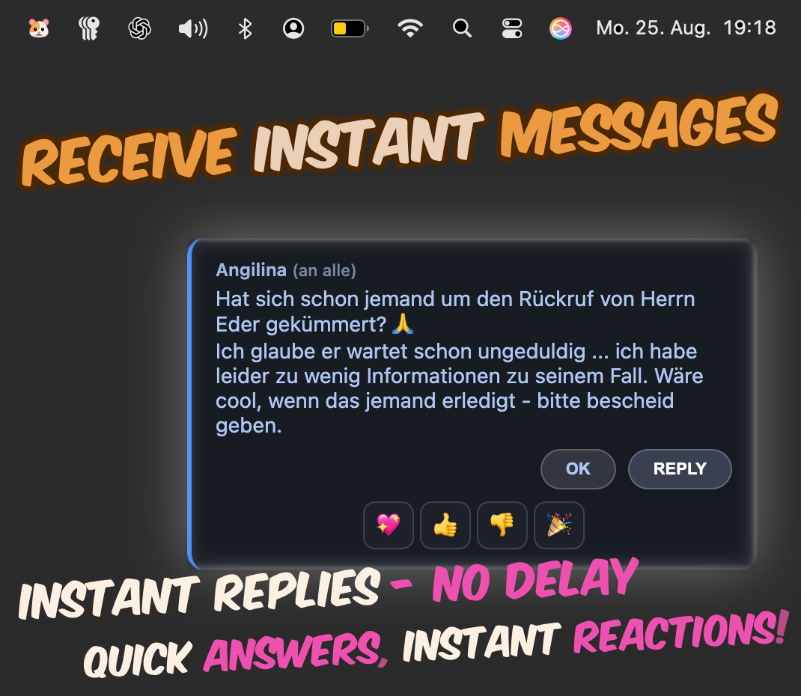</td>
    <td align="center">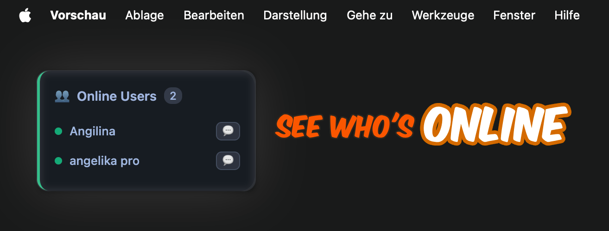</td>
 </tr>
  <tr>
    <td align="center"></td>
    <td align="center">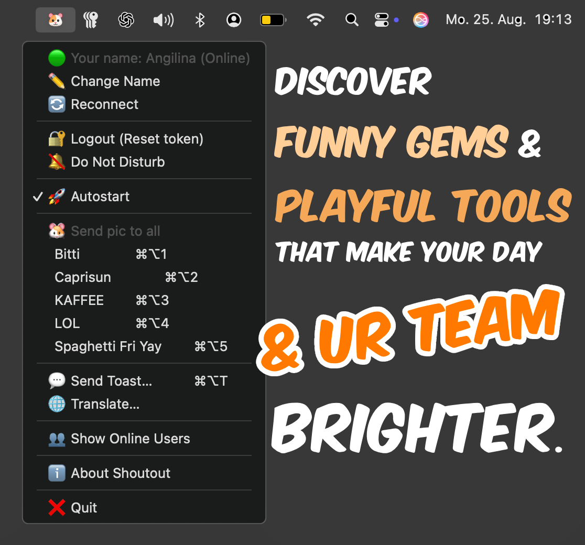</td>
 </tr>
  <tr>
    <td align="center"><strong>Admin & Translate</strong></td>
    <td align="center"><strong>Special Hamsters & Toasts</strong></td>
 </tr>
  <tr>
    <td align="center">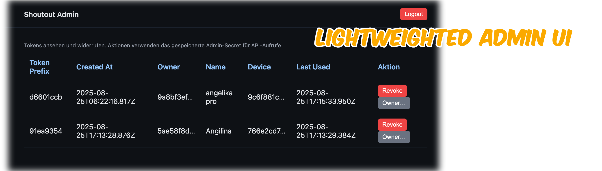</td>
    <td align="center">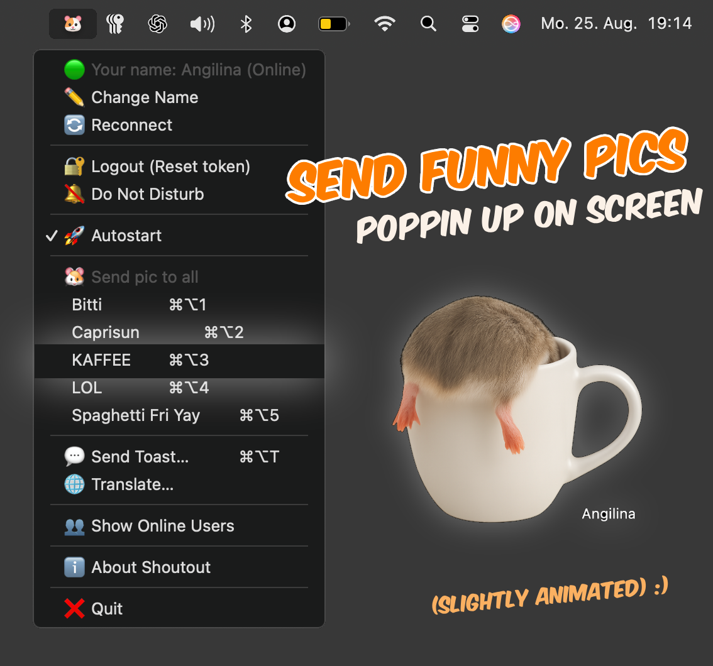</td>
 </tr>
   <tr>
    <td align="center">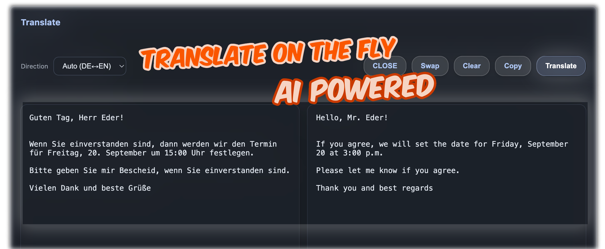</td>
    <td align="center">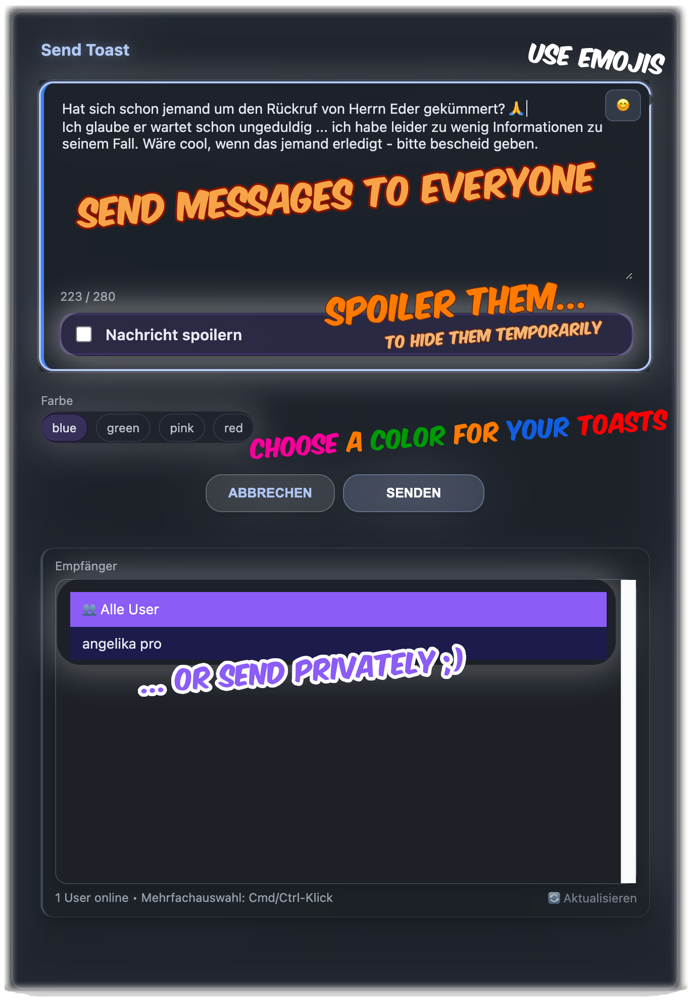</td>
 </tr>
  <tr>
    <td align="center"><strong>Login & Invite</strong></td>
    <td align="center"><strong>Spoiler & Info</strong></td>
 </tr>
  <tr>
    <td align="center">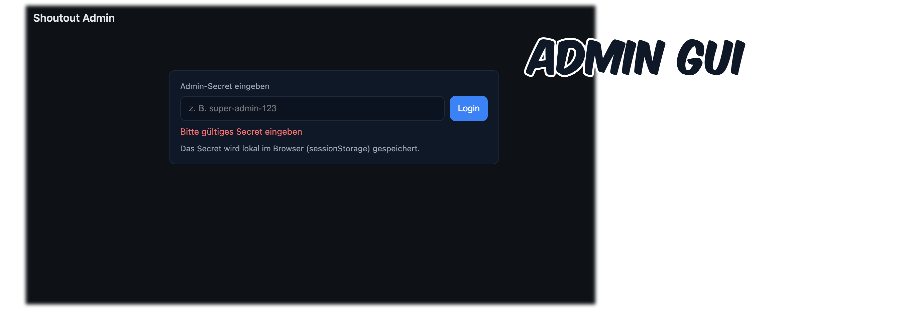</td>
    <td align="center">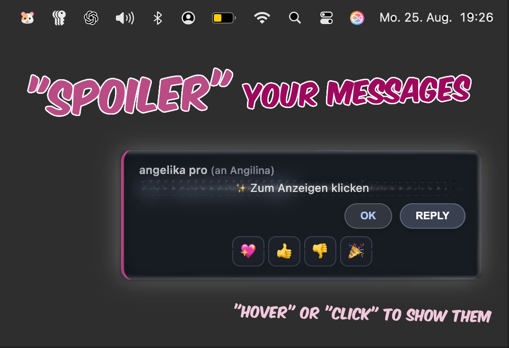</td>
 </tr>
   <tr>
    <td align="center">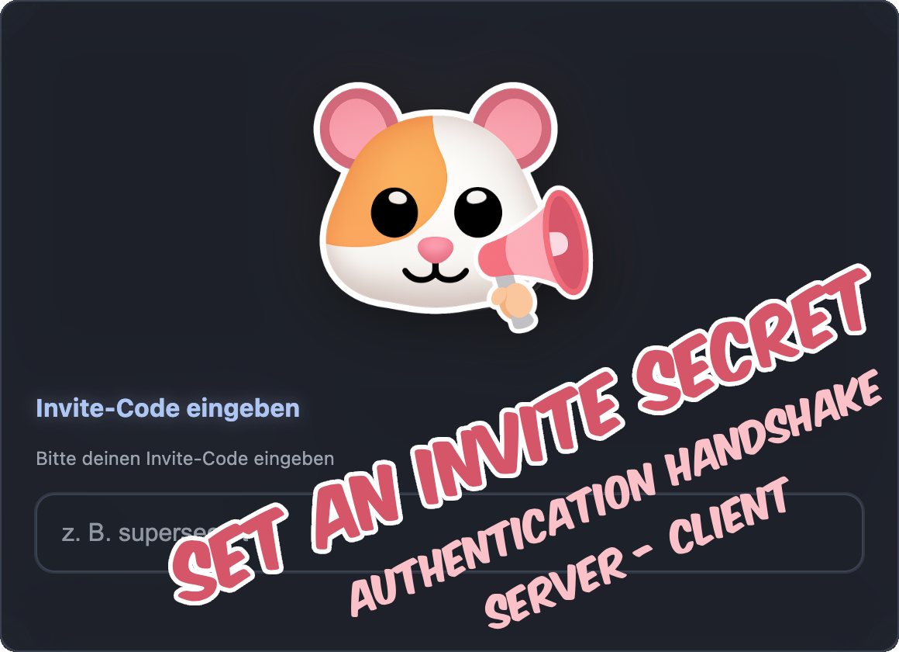</td>
    <td align="center">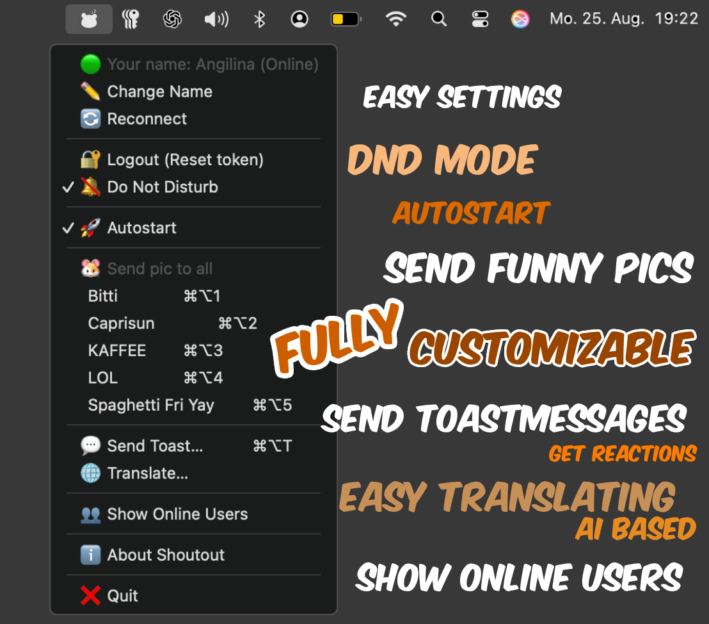</td>
 </tr>
</table>

---

## 📥 Installation

### 🪟 Windows

1. **Download** den Windows Installer (`.exe`)
2. **Doppelklick** auf die Datei
3. **Installation bestätigen** und folgen
4. **App starten** über Start-Menü oder Desktop

### 🍎 macOS

1. **Download** den macOS Installer (`.dmg`)
2. **DMG öffnen** und App in den Applications-Ordner ziehen
3. **App starten** über Applications-Ordner

**⚠️ Wichtig:** Bei der ersten Ausführung zeigt macOS "Datei beschädigt" an. Das ist normal für nicht-code-signed Apps!

**Lösung:**

```bash
# 1. Quarantäne-Flag entfernen
xattr -dr com.apple.quarantine "/Applications/Shoutout.app"

# 2. Ad-hoc signieren
codesign --force --deep --sign - "/Applications/Shoutout.app"

# 3. App starten
open "/Applications/Shoutout.app"
```

**Alternativ:** Rechtsklick auf die App → "Öffnen" wählen

---

## 🎮 Verwendung

### ⌨️ Global Hotkeys

- **`Cmd+Alt+H`** (macOS) / **`Ctrl+Alt+H`** (Windows) - Hamster anzeigen
- **`Cmd+Alt+T`** (macOS) / **`Ctrl+Alt+T`** (Windows) - Toast senden
- **`Cmd+Alt+1`** / **`Ctrl+Alt+1`** - Caprisun Hamster
- **`Cmd+Alt+2`** / **`Ctrl+Alt+2`** - LOL Hamster

### 🎯 Tray Menu

- Statuszeile: „🟢 Your name: … (Online/…)“ — nicht klickbar
- ✏️ Change Name — aktiv wenn verbunden
- 🔄 Reconnect — immer verfügbar (außer beim Verbinden)
- 🔐 Logout (Token zurücksetzen) — aktiv wenn verbunden
- 🔕 Do Not Disturb — aktiv wenn verbunden
- 🚀 Autostart — aktiv wenn verbunden
- —
- 🐹 Send hamster — aktiv wenn verbunden
- 💬 Send Toast… — aktiv wenn verbunden
- 🌐 Translate… — aktiv wenn verbunden
- 👥 Show Online Users — aktiv wenn verbunden
- ℹ️ About Shoutout — aktiv wenn verbunden
- —
- ❌ Quit — immer verfügbar

### 💬 Toast System

- **Persönlich** - Nur für einen User
- **Broadcast** - Für alle User
- **Reply** - Direkte Antwort auf Nachricht
- **Emoji Reactions** - 💖 👍 👎 🎉

---

## 🔧 Technische Details

### 🔑 Admin UI

- URL: `https://<dein-host>/admin` (hinter Caddy) oder `http://localhost:3001/admin` direkt am Server
- Login: ADMIN_SECRET im Eingabefeld; die UI sendet es als Bearer‑Token
- Funktionen: Tokens auflisten, Token widerrufen, Owner neu zuordnen

### 🏗️ Tech Stack

- **Frontend**: Electron, HTML5, CSS3, Vanilla JavaScript
- **Backend**: Node.js, Express, WebSocket (ws)
- **Logging**: Winston, Daily Rotation
- **Build**: electron-builder, npm scripts
- **Styling**: CSS Grid, Flexbox, Glass Effects, Animations
- **Translation (optional, serverseitig)**: Python‑Stub + HuggingFace Marian (OPUS‑MT), optional CTranslate2

### 📁 Projektstruktur (aktuell)

```
shoutout/
├── client/                         # Electron Desktop App
│   ├── main.js                   # Hauptprozess (Tray, Overlays, WS)
│   ├── preload.js                # IPC Bridge (Overlay)
│   ├── preload_compose.js        # IPC Bridge (Toast-Compose)
│   ├── preload_name.js           # IPC Bridge (Name-Änderung)
│   ├── preload_status.js         # IPC Bridge (Status-Overlay)
│   ├── preload_reaction.js       # IPC Bridge (Reaction-Overlay)
│   ├── preload_userlist.js       # IPC Bridge (User-List)
│   ├── preload_invite.js         # IPC Bridge (Invite)
│   ├── preload_translate.js      # IPC Bridge (Translate)
│   ├── preload_about.js          # IPC Bridge (About)
│   ├── renderer/
│   │   ├── overlay.html          # Haupt-Overlay
│   │   ├── overlay.js            # Overlay-Logic (klassisch)
│   │   ├── overlay-new.js        # Overlay-Logic (neu)
│   │   ├── compose.html          # Toast-Erstellung (Glass)
│   │   ├── name.html             # Name-Änderung (Glass)
│   │   ├── invite.html           # Invite-Dialog (Glass)
│   │   ├── translate.html        # Translate (optional)
│   │   ├── status.html/js        # Status-Overlay
│   │   ├── reaction.html/js      # Reaction-Overlay
│   │   ├── userlist.html/js      # Online User List
│   │   ├── about.html            # About-Fenster
│   │   └── style.css             # Gemeinsame Styles
│   └── assets/
│       ├── icon/                 # App Icons
│       └── hamsters/             # Hamster-Varianten
├── server/                        # WebSocket Hub + HTTP API
│   ├── src/index.js              # Express + WS Server
│   ├── config/
│   │   ├── tokens.json           # Ausgestellte Tokens (gitignored)
│   │   └── invites.json          # Optionale Invite-Codes (Array)
│   ├── assets/hamsters/          # Serverseitige Hamster-Bilder
│   └── logs/                     # Winston Logfiles
├── bot/                           # Discord Bot (optional)
│   └── src/index.js              # Bot Logic + Commands
├── .github/workflows/build.yml    # Build-Pipeline (ohne WS_TOKEN)
└── package.json                   # Workspace Management
```

### 🔌 API Endpoints

#### WebSocket Events

```javascript
// Hamster Event
{
  type: "hamster",
  variant: "default" | "caprisun" | "lol",
  duration: 3000,
  target: "username", // optional
  sender: "username"
}

// Toast Event
{
  type: "toast",
  message: "Nachricht (max 280 Zeichen)",
  severity: "blue" | "green" | "pink" | "red" | "info" | "success" | "warn" | "critical",
  target: "username", // optional
  sender: "username"
}

// Reaction Event
{
  type: "reaction",
  reaction: "💖" | "👍" | "👎" | "🎉",
  targetUserId: "uuid",
  fromUser: "username"
}

// Translate (Server, optional)
// HTTP JSON: POST /translate
// Body:
// {
//   text: "Freitext oder E-Mail-Inhalt",
//   direction: "auto" | "de->en" | "en->de",
//   formatMode: "auto" | "email" | "plain"
// }
// Response: { ok, from, to, format, translated }
```

#### HTTP Endpoints

```bash
# Invite: Austausch Invite-Code gegen Client-Token
POST /invite
Content-Type: application/json
{ "inviteCode": "supersecret1" }

# Token-Check (keine Nebenwirkungen)
GET /auth-check
Authorization: Bearer <token>

# Broadcast (geschützt)
POST /broadcast
Authorization: Bearer <token>
Content-Type: application/json

# Self-Revoke (Client kann eigenen Token widerrufen)
DELETE /revoke-self
Authorization: Bearer <token>

# Admin API (mit ADMIN_SECRET)
GET /tokens
Authorization: Bearer <ADMIN_SECRET>

DELETE /revoke/:tokenOrPrefix
Authorization: Bearer <ADMIN_SECRET>

# Admin UI (HTML)
GET /admin
# UI mit Login-Feld; Admin-Secret wird in der Sitzung (sessionStorage) gespeichert

# Online Users List
GET /users
```

#### Admin Utilities

- Token-Eigentümer ändern (Admin):

```bash
PATCH /reassign-owner/:tokenOrPrefix
Authorization: Bearer <ADMIN_SECRET>
Content-Type: application/json
{ "ownerId": "<new-user-id>" }
```

Hinweis: Der Server trennt bestehende Verbindungen des Tokens sofort (4001 „Token owner changed“); Clients müssen sich neu authentifizieren.

### 🧭 Onboarding & Tokens

- Erste App-Ausführung: Der Client zeigt eine kleine Eingabemaske „Invite‑Code eingeben“. Nach Erfolg wird der Token lokal gespeichert und der WS‑Handshake nutzt `Authorization: Bearer <token>`.
- Revoke: Widerruft ein Admin einen Token, trennt der Server die WS‑Verbindung (Code 4001). Der Client löscht den lokalen Token, zeigt die Invite‑Maske und verbindet nach Eingabe erneut – ohne App‑Neustart.
- Logout: Tray → „🔐 Logout (Token zurücksetzen)“ widerruft best‑effort (`DELETE /revoke-self`), löscht die lokale Datei und startet die App neu, um die Invite‑Maske zu zeigen.
- Reconnect: Bei manuellem „🔄 Reconnect“ prüft der Client den Token via `/auth-check` und fordert bei 401 den Invite‑Code erneut an.

### 🔐 Ownership Binding

- Jeder ausgegebene Token wird an eine stabile `ownerId` (UserID) gebunden; optional wird eine `deviceId` gespeichert.
- Der Client erzeugt/persistiert `userId` und `deviceId` in `client` → `shoutout-user.json` und sendet diese bei:
  - Invite: `POST /invite { inviteCode, ownerId, deviceId }`
  - WS-Handshake: Header `x-client-user: <userId>`, `x-client-device: <deviceId>`
  - Auth-Check: `GET /auth-check` mit `x-client-user`
- Server prüft im Invite‑Modus, dass `x-client-user` mit der beim Token gespeicherten `ownerId` übereinstimmt:
  - WS: 401 bei Mismatch (Client re‑authentifiziert)
  - `/auth-check`: 401 bei Mismatch
  - `/broadcast`: 401 bei Mismatch (kein HTTP‑Bypass)
- Admin UI zeigt zusätzlich den aktuellen Anzeigenamen (falls verbunden), sowie Device‑Prefix und `lastUsedAt`.

---

## 🚨 Troubleshooting

### ❌ Häufige Probleme

#### App startet nicht

```bash
# Alle Electron-Prozesse beenden
pkill -f "electron"

# Dependencies neu installieren
rm -rf node_modules server/node_modules client/node_modules bot/node_modules
npm install
```

#### WebSocket-Verbindung fehlschlägt

```bash
# Server-Status prüfen
curl http://localhost:3001/health

# Port prüfen
lsof -i :3001
```

#### Build-Fehler

```bash
# Dependencies prüfen
npm --workspace client ls electron

# electron-builder neu installieren
npm install --workspace client --save-dev electron-builder
```

#### macOS: Ghosting/Phantom bei Toasts

Betroffene Systeme: Vor allem Apple Silicon (M1/M2) MacBooks mit transparenten Electron-Fenstern und `backdrop-filter`/starken Schatten.

Symptom: Nach dem Schließen eines Toasts bleibt eine „Geisterspur“/ein Phantom am Bildschirm stehen, bis ein Repaint erzwungen wird (Fenster bewegen, Mission Control, etc.).

Status: Behoben durch Workaround in `client/renderer/style.css` und `client/renderer/overlay-new.js` (Compositing-Hinweise + kurzes Fade‑Out). Keine Funktionsänderung, nur stabilere Repaints.

Manuelle Checks/Workarounds, falls es bei dir dennoch auftritt:

- Diagnose: `npm --workspace client start -- --disable-gpu` — wenn das Phantom verschwindet, ist es GPU/Compositing-bedingt.
- DevTools‑Test: In Elements `.bubble` auswählen und `backdrop-filter` temporär deaktivieren; Toast schließen.
- Anzeigeeinstellungen: Systemeinstellungen → Bedienungshilfen → Anzeige → „Transparenz reduzieren“ testweise umschalten.
- Skalierung: Systemeinstellungen → Displays → Auf „Standard“ statt „Mehr Platz“ testen.
- Externes Display trennen und nur das interne Panel testen.

Hinweis: Der eingebaute Fix erzwingt ein sauberes Repaint über `translateZ(0)`, `backface-visibility: hidden`, `will-change`, `contain: paint` sowie ein kurzes Ausblend‑Transition, bevor ein Toast entfernt wird.

### 🔍 Debug-Modus

- DevTools: `client/.env` → `OPEN_DEVTOOLS=true`
- About-Logs: `client/.env` → `DEBUG_ABOUT=1`
- Server-Logs: `docker compose logs -f server` (oder `npm run start:server` im Dev)

---

## 🤝 Contributing

**Wir freuen uns über deine Beiträge!** 🎉

### 📋 Contributing Guidelines

1. **Fork** das Repository
2. **Feature Branch** erstellen (`git checkout -b feature/amazing-feature`)
3. **Changes** committen (`git commit -m 'Add amazing feature'`)
4. **Branch** pushen (`git push origin feature/amazing-feature`)
5. **Pull Request** erstellen

### 🎯 Entwicklungsworkflow

```bash
# Feature Branch erstellen
git checkout -b feature/new-feature

# Änderungen machen
# ... code ...

# Checks laufen lassen
npm run check

# Committen
git add .
git commit -m "feat: add new feature"

# Pushen
git push origin feature/new-feature
```

### 🧪 Testing

```bash
# Syntax-Checks und Production-Audits
npm run check
```

Automatisierte Unit-/Integrationstests sind noch nicht eingerichtet.

---

## 🙏 Danksagungen

- **Electron Team** - Für das fantastische Framework
- **Node.js Community** - Für die großartigen Packages
- **CSS Glass Effects** - Für die wunderschöne UI
- **Hamster-Community** - Für die Inspiration 🐹

---

## 📞 Support

- **Issues**: [GitHub Issues](https://github.com/yourusername/shoutout/issues)
- **Discussions**: [GitHub Discussions](https://github.com/yourusername/shoutout/discussions)
- **Wiki**: [GitHub Wiki](https://github.com/yourusername/shoutout/wiki)

---

**Made with ❤️ and 🐹 by the Shoutout Team Angilina und Cursor AI Claude und GPT**

**Letzte Aktualisierung**: April 2026
**Version**: 1.0.4  
**Status**: 🟢 Produktionsreif
# 🧭 Self‑Hosting Quick Start

1) Server vorbereiten
- `cp server/env.example server/.env` und Werte setzen:
  - `ADMIN_SECRET`, `INVITE_CODES`, `ALLOW_NO_AUTH=false`
  - optional Übersetzer: `TRANSLATOR_ENABLED=true`, Modelle unter `server/models`
- Starten: `docker compose up -d --build`

2) Invite Codes
- Entweder in `server/.env` (`INVITE_CODES=code1,code2`) oder `server/config/invites.json` (Array) hinterlegen.

3) Client konfigurieren
- `client/.env` anlegen:
  - `WS_URL=ws://<dein-host>/ws`
  - `SERVER_URL=http://<dein-host>` (oder `https://` hinter Caddy)
  - optional: `OPEN_DEVTOOLS=true` für Tests

4) Client starten/bauen
- Dev: `npm run dev:client`
- Build macOS: `npm run build:client:mac`
- Build Windows: `npm run build:client:win`
- Build Linux: `npm --workspace client run build:linux`

5) Erster Start
- Client zeigt „Invite‑Code eingeben“. Code eingeben → Token wird lokal gespeichert → Verbindung steht.
